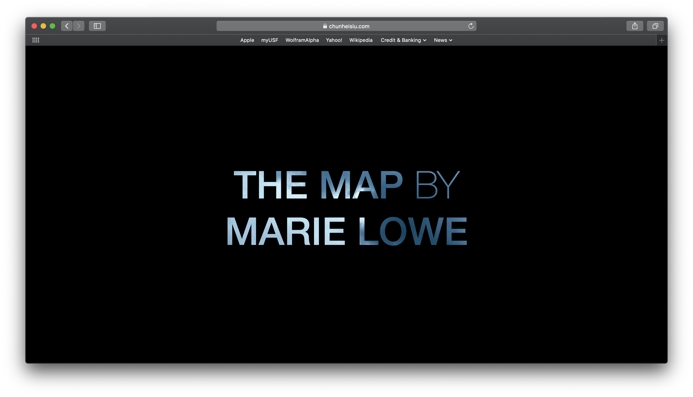
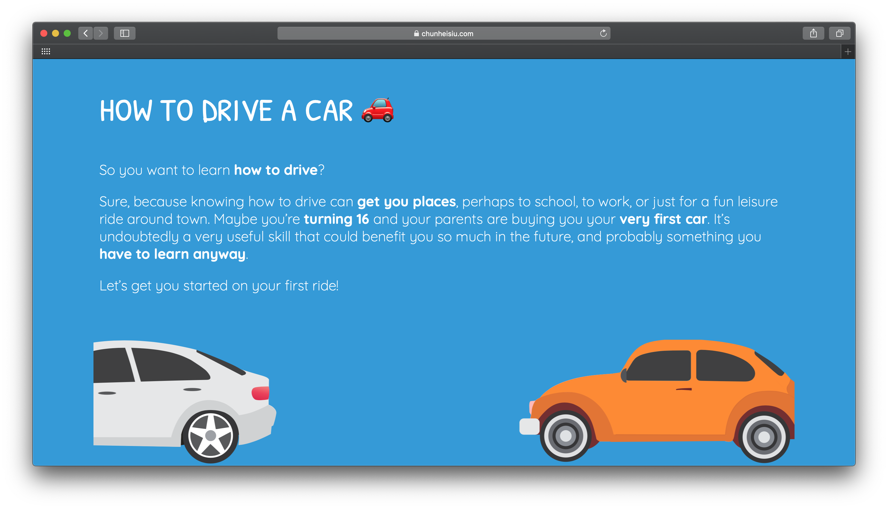

## USF ART 175: Visual Communication II
Selected Projects: *Words in Motion* and *How to Drive a Car*

### Words in Motion

*Words in Motion* is a website that translates the poem The Map by Marie Lowe into a digital form. The website was create to place the reader into the atmosphere of the poem, and engages the reader by introducing various visual effects and interactions within the page. The website also incorporates JavaScript viewport scrolling detection and CSS3 animations and transformation. The inspiration of the website comes from various concrete poetry examples during ART 175 class. The aim for this website is to visualize the poem in a way that is different than the author original intend.

[Link](https://chunheisiu.com/USF-ART175-Projects/wordsinmotion/)

### How to Drive a Car

*How to Drive a Car* is a website that gives the user an introductory tour of how to drive a car. The inspiration for the website comes from the artist’s anxiety when first learning how to drive, as the many components of the car can be intimidating for novice drivers. The informal language and cartoon-styled illustrations make the tutorial more approachable to new drivers of younger age. By creating the tutorial, the artist aims to eliminate the difficulty of learning how to drive.

[Link](https://chunheisiu.com/USF-ART175-Projects/howto/)
